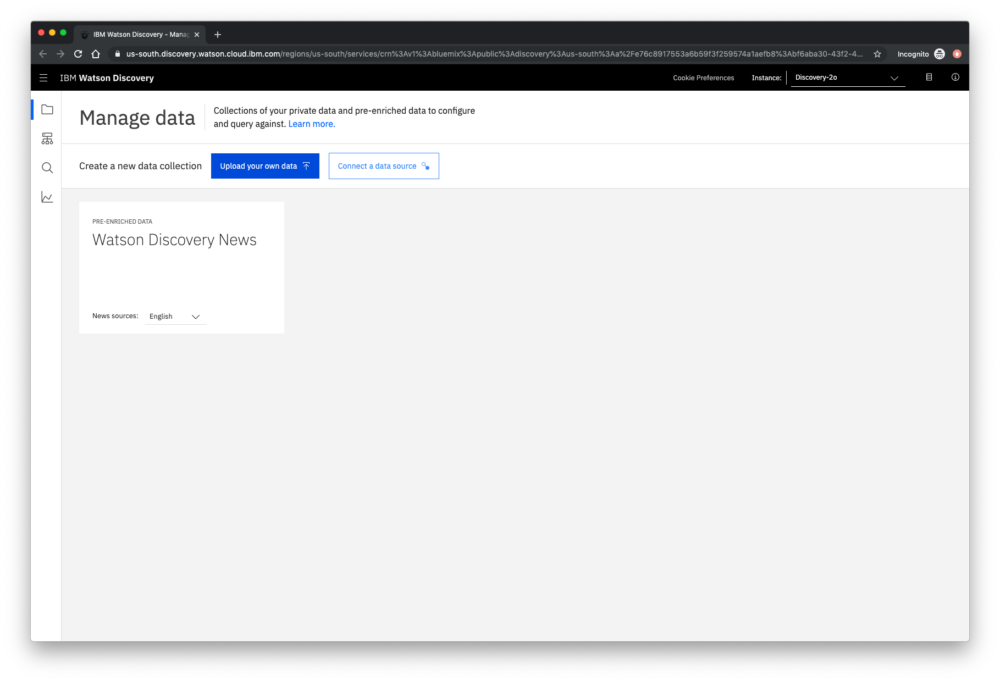

## Launch Discovery and Import the data

First, launch Watson Discovery from your Cloud Pak for Data instance.

Next, create a new data collection by selecting the **Upload your own data** option. Give the data collection a unique name. For example, "CPD-workshop". 

On the next screen, you'll see **Upload data to get started** in the middle of the page. Click **select documents**, and choose the `ecobee3_UserGuide.pdf` file located in the data directory of your local repo to upload.

The [Ecobee](https://www.ecobee.com/) is a popular residential thermostat that has a wifi interface and multiple configuration options.

Next, let's do some simple queries on the data so that we can understand the results found.

Click the **Build your own query** button.

Enter queries related to the operation of the thermostat and view the results. As you will see, the results can vary. 

As a further exercise for after the workshop (homework!), try improving the results using [Watson Smart Document Understanding (SDU)](https://cloud.ibm.com/docs/services/discovery?topic=discovery-sdu) and/or [Watson Knowledge Studio (WKS)](https://cloud.ibm.com/catalog/services/knowledge-studio).

## Credentials
Store credentials for future use

In upcoming steps, you will need to provide the credentials to access your Discovery collection. The values can be found in the following locations.

The **Collection ID** and **Environment ID** values can be found by clicking the dropdown button located at the top right side of your collection panel:

For credentials, return to the main panel of your Discovery service, and click the **Service credentials** tab:

Click the **View credentials** drop-down menu to view the IAM **apikey** and **URL** endpoint for your service.

Next, we'll setup Watson Assistant.
