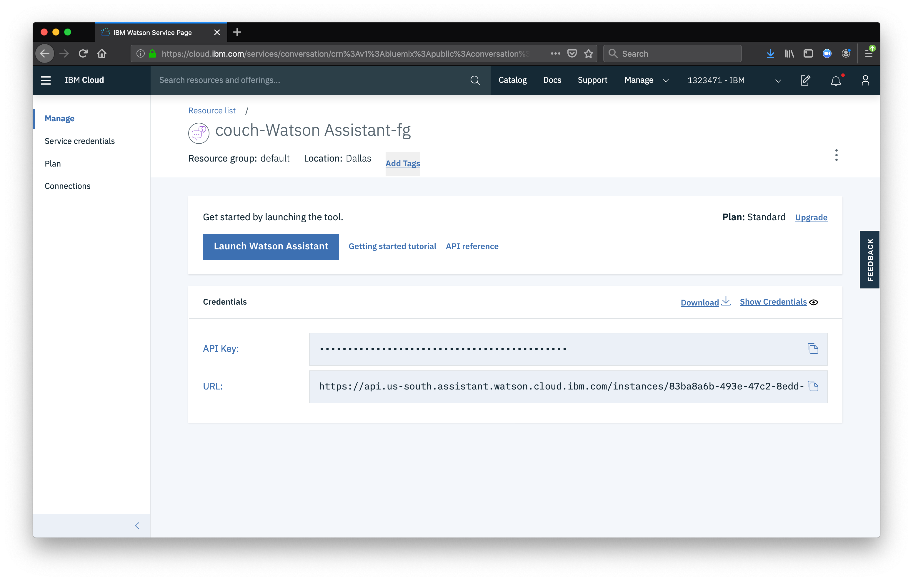
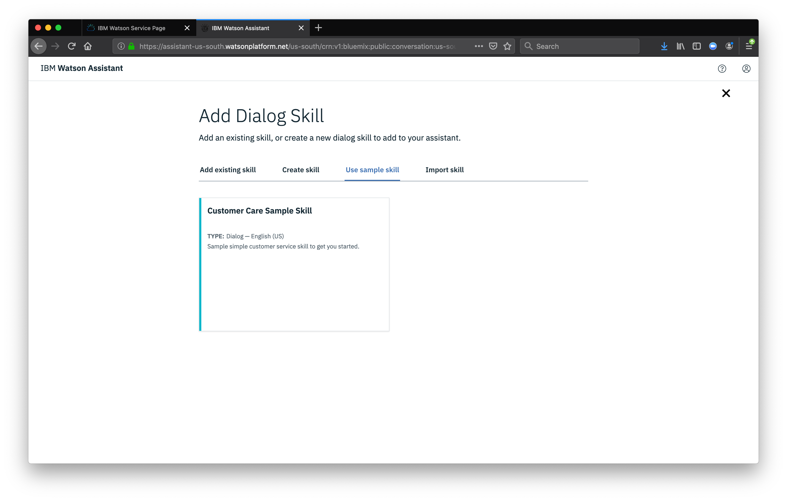

Now let's set up the chatbot component using Watson Assistant.

## Launch Watson Assistant

First, launch Watson Assistant from your Cloud Pak for Data instance.

Next we will add a dialog skill to our assistant. We'll use the sample customer care skill to start.

Now that we have the skill, we need to create a new Intent. An intent is a way to describe an action, in our case we want to create an intent that can detect when the user is asking about operating the thermostat.

Then we will give our intent several examples of a user asking about product information

Now we need to add a new dialog node. Our node will be used to tell the chatbot how to handle our new intent. Click on the Dialog menu item then click on the Greetings node, select New node Below

Name the node "Ask about product" and assign it our new intent.

Now that we've defined our intent and assigned it to the dialog node, if our Watson Assistant recognizes a user input such as "how do I set the time?", it will direct the conversation to this node.

## Setup webhook

Set up access to our webHook for the IBM Cloud Functions action you previously created.

Select the Options tab. And then add the webhook address

## Add node response
Return to the Dialog tab, and click on our "Ask about product" node. From the details panel for the node, click on Customize, and enable Webhooks for this node. Click apply

The dialog node should have a Return variable set automatically to `$webhook_result_1`. This is the variable name you can use to access the result from the Discovery service query.

Finally, we alsp also need to pass in the users question via the parameter input. The key needs to be set to the value:

## Test in Assistant Tooling
From the Dialog panel, click the Try it button located at the top right side of the panel. This is where we can test the chatbot in our development environment.

Note that the input "how do I turn on the heater?" has triggered our Ask about product dialog node, which is indicated by the #Product_Information response.

Next, we'll configure and run a Node.js application that will tie all these pieces together for a customer support app demo.
