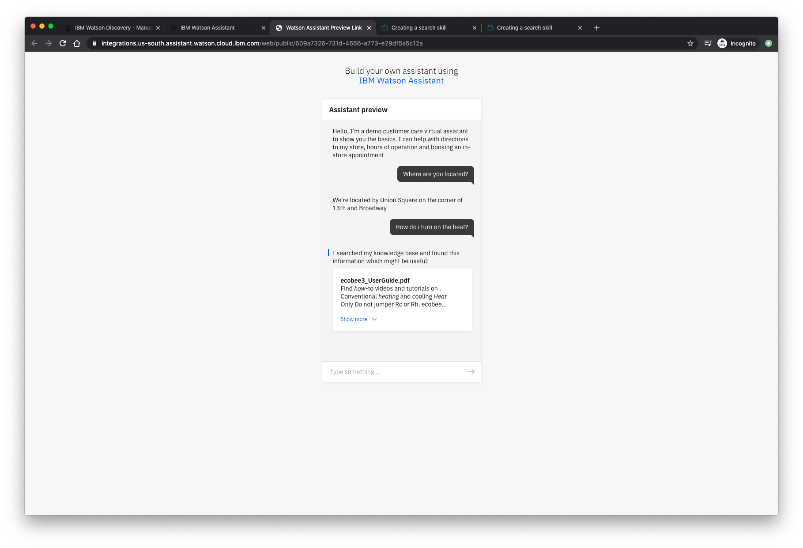
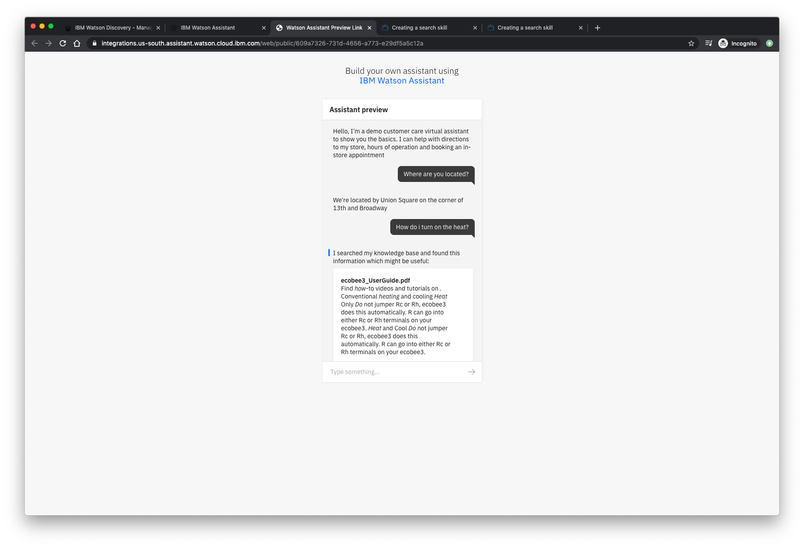

In this final step, we're going to configure and test the customer care application that ties Watson Discovery and Watson Assistant together in a web-based chatbot application.

In prior steps, we created skills for our Assistant along with configuring and uploading data to Discovery.

Now we're going to create the Assistant and then add the skills we previously configured.

Finally, we'll preview our new customer care application.

-Navigate to Watson Assistant

SCREENSHOT
-Click **Create Assistant**

## Add the skill to our Assistant

## Search triggers

Then try entering some of these sample questions and examine the results:

* **How do I set a schedule?**
* **How do I set the temperature?**
* **How do I set the time?**

## Sample application output

BONUS add web chat integration
