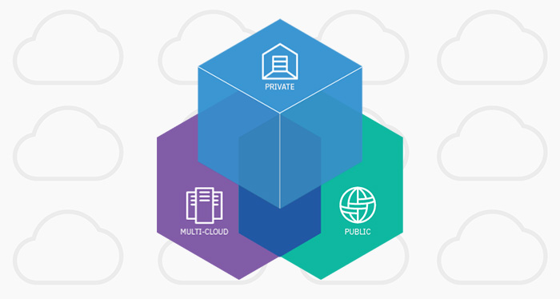

# Enhancing customer help desks with Watson Discovery and Assistant on IBM Cloud Pak for Data

 

## What you will build

In this workshop, we walk you through a working example of a customer service app that utilizes two Watson services on [IBM Cloud Pak for Data](https://www.ibm.com/products/cloud-pak-for-data) to create a better customer care experience. Here, we use the typical customer care chatbot experience but instead of relying on predefined responses, our dialog will use a search skill that can call out to IBM Watson Discovery for additional sources of information. In our case, it will be an owners manual that has been uploaded into Watson Discovery.

Using Watson Discovery, document queries will be focused to search the most relevant information found in a typical owner's manual.

Using Watson Assistant, we'll use a standard customer care dialog to handle a typical conversation between a custmomer and a company representitive. When a customer question involves operation of a product, the Assistant dialog will communicate with the Discovery service using a search skill.

In addition to exploring Watson Discovery and Assistant,we'll also examine IBM Cloud Pak for Data and discuss the differences between public, private, and hybrid clouds.

The typical customer care chatbot can answer simple questions, such as store locations and hours, directions, and maybe even making appointments. When a question falls outside of the scope of the pre-determined question set, the option is typically to tell the customer the question isn’t valid or offer to speak to a real person.

In this workshop, we'll provide another option. If the customer's question is about the operation of a device, we'll use the webhook feature of Watson Assistant to pass the question onto our Watson Discovery Service, which has been pre-loaded with the device’s owners manual. So now, instead of “Would you like to speak to a customer representative?” we can return relevant sections of the owners manual to help solve our customers’ problems.

### What is Watson Discovery?

[Watson Discovery](https://www.ibm.com/cloud/watson-discovery) is an award-winning cloud search and AI search technology that breaks open data silos and retrieves specific answers to your questions while analyzing trends and relationships buried in enterprise data. Watson Discovery applies the latest breakthroughs in machine learning, including natural language processing capabilities, and is easily trained on the language of your domain. Unlike competitors, a Watson Discovery search app can be deployed on any cloud or on-premises environment.

### What is Watson Assistant?

[Watson Assistant](https://www.ibm.com/cloud/watson-assistant/) is IBM’s AI product that lets you build, train, and deploy conversational interactions into any application, device, or channel.

Most chatbots try to mimic human interactions, which can frustrate users when a misunderstanding arises. Watson Assistant is more. It knows when to search for an answer from a knowledge base, when to ask for clarity and when to direct users to a human. Watson Assistant can be deployed in any cloud or on-premises environment – meaning smarter AI is finally available wherever you need it.

### What are search skills?

Watson Assistant can use a search skill to route complex customer inquiries to the Watson Discovery service. Discovery treats the user input as a search query and it finds information that is relevant to the query from an external data source returning it to the assistant.

Instead of having Assistant say things like, `I'm sorry. I can't help you with that`, the assistant can instead query existing company documents or data to see whether any useful information can be found and shared with the customer.

The following short video provides an overview of search skills:

<iframe width="560" height="315" src="https://www.youtube.com/embed/ZcgGf8J2Cfw" frameborder="0" allow="accelerometer; autoplay; encrypted-media; gyroscope; picture-in-picture" allowfullscreen></iframe> 

The search skill searches for information from a data collection that you create by using the Discovery service. Discovery crawls, converts, and normalizes your unstructured data. It applies data analysis and cognitive intuition to enrich your data such that you can more easily find and retrieve meaningful information from it later.

Typically, the type of data collection you add to Discovery and access from your assistant contains information that is owned by your company. This proprietary information can include FAQs, sales collateral, technical manuals, or papers written by subject matter experts. Mine this dense collection of proprietary information to find answers to customer questions quickly.

The following diagram illustrates how user input is processed when both a dialog skill and a search skill are added to an assistant:

## Goals
After completing this workshop, you'll understand how to:
* Find your way around IBM Cloud Pak for Data.
* Understand IBM Watson Discovery
* Understand IBM Watson Assistant
* Understand search skills

## Estimated length of workshop
* 2-3 hours

## Prerequisites
* **Recommended:** A basic understanding of using terminal
* **Required:** Access to a Cloud Pak for Data instance running at least version 2.5

## Agenda
* Exploring IBM Cloud Pak for Data
* What is IBM Watson
* Setup and installation
* Hands on Workshop
* Wrap-up

Let's get started!
