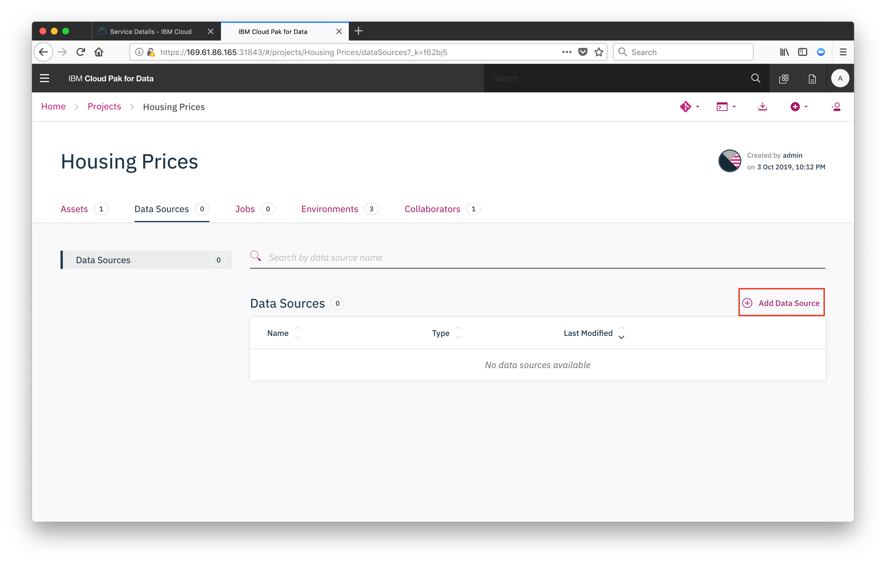
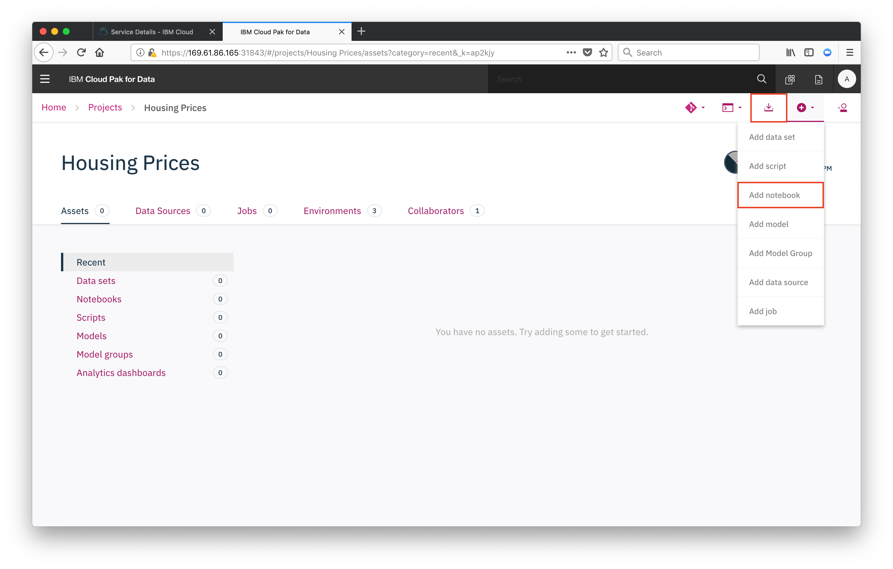
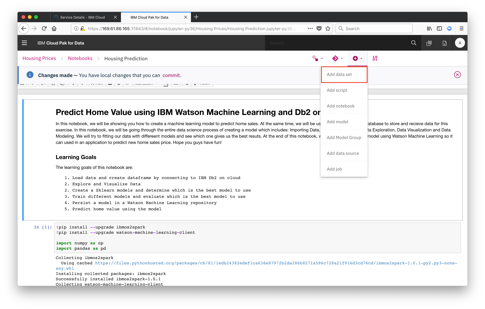
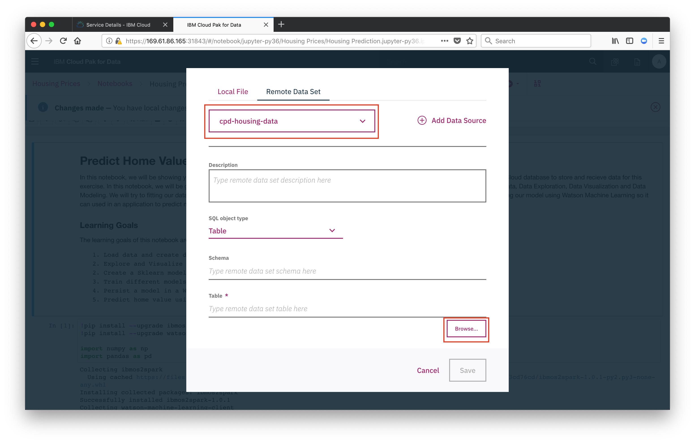

## Create Project
From the home page of your CPD instance, click `New Project`.

## Add Data Source
From your project's landing page, click on `Data Sources` then `Add Data Source`

## Import the Notebook
From the project overview click the `New Asset` button, and choose `Add notebook`.

Click `From URL` and use the following: `https://github.com/tmarkiewicz/ibm-cpd-workshop/blob/master/_cpd-wml/notebooks/WML-DB2.ipynb`

Next, we need to add our data to the notebook, click `Add data set`

Then select remote, and select the data source that we added to the project.

