## Apache OpenWhisk using IBM Cloud Functions

Based on [Apache OpenWhisk](https://openwhisk.apache.org/), [IBM Cloud Functions](https://www.ibm.com/cloud/functions) is a polyglot functions-as-a-service (FaaS) programming platform for developing lightweight code that scalably executes on demand.

* **Explore an open-ended ecosystem**
 Provides access to the Apache OpenWhisk ecosystem in which anyone can contribute their action code as building blocks to the expanding repository.

* **Speed and simplify development**
 Accelerates application development, which enables developers to quickly build apps with action sequences that execute in response to our event-driven world.

* **Leverage the benefits of cognitive services**
 IBM Cloud Functions, by offering easy access to IBM Watson APIs within the event-trigger-action workflow, makes cognitive analysis of application data inherent to your workflows.

* **Pay for what you actually use**
 It’s simple: pay for actual use rather than pre-allocated capacity. Costs increase only as you construct more OpenWhisk-intensive solutions or as existing solutions scale to support bigger loads.

* **Packages for Common Tasks**
 A package combines the actions and event-feed triggers necessary to accomplish a common set of tasks. For example, the IBM Cloudant package provides two actions, read and write, and one trigger feed called changes. The changes feed causes triggers to be fired when documents are added to the specified Cloudant database. Some other packages automatically available with IBM Cloud Functions include Push Notifications (for mobile apps), Message Hub, IBM Watson, The Weather Company, Slack, and GitHub.

## Create the IBM Cloud Functions action
Now let's create the web action that will make queries against our Discovery collection.

Start the **IBM Cloud Functions** service by selecting **Create Resource** from the IBM Cloud dashboard. Enter **functions** as the filter, then select the **Functions** card:

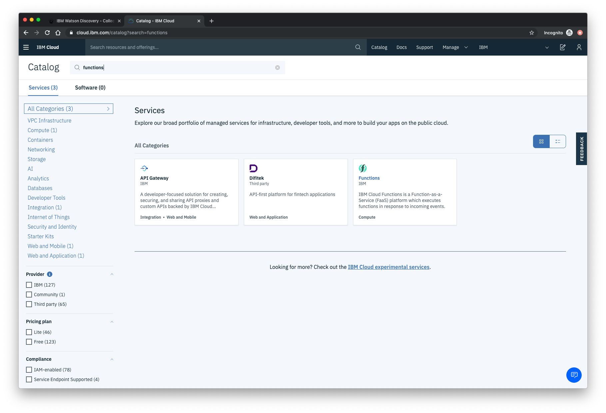
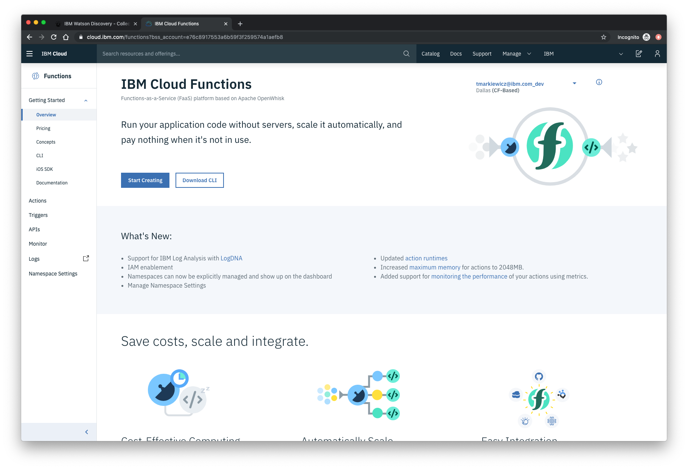

From the **Functions** main panel, click on the **Actions** tab. Then click on *Create*.

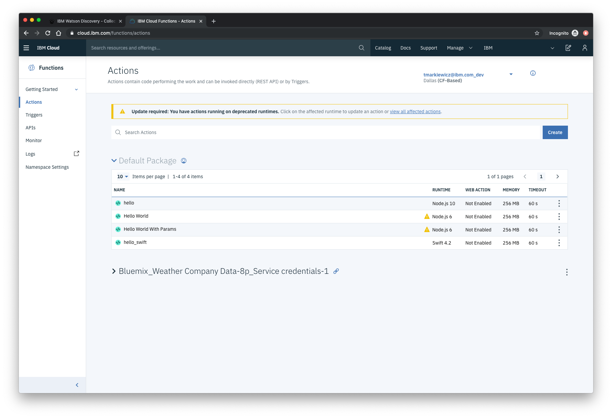

From the **Create** panel, select the **Create Action** option.

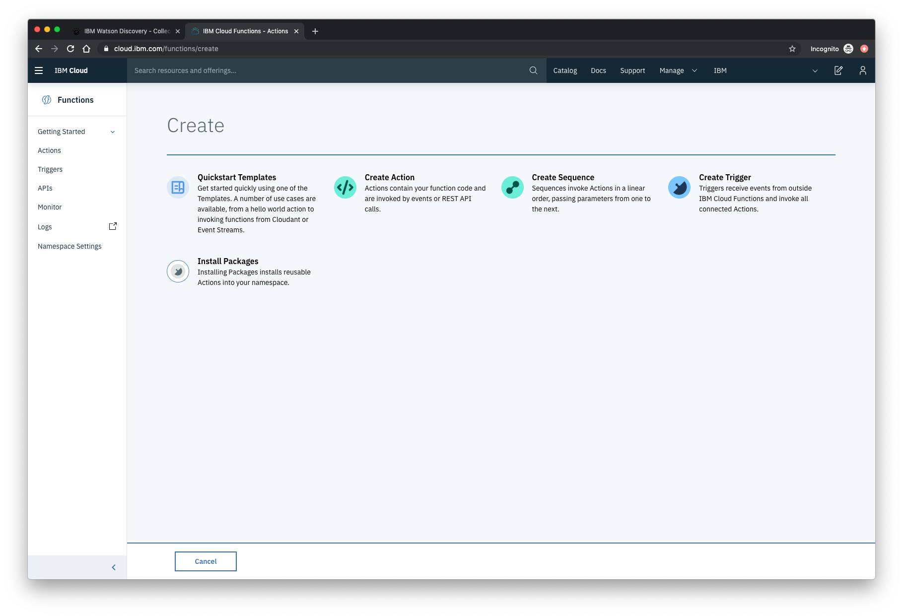

On the **Create Action** panel, provide a unique **Action Name**, keep the default package, and select the **Node.js 10** runtime. Click the **Create** button to create the action.

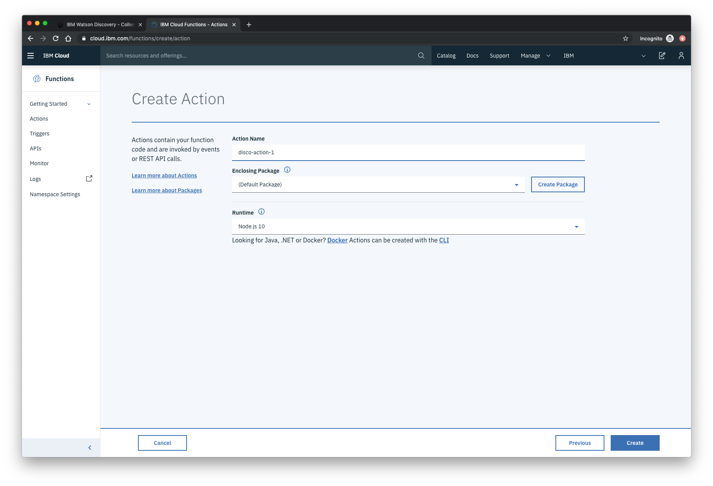

Once your action is created, click on the **Code** tab:

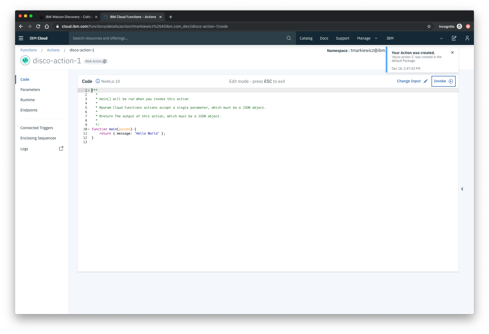

In the code editor window, cut and paste in the code from the `disco-action.js` file found in the `actions` directory of your local repo. The code is pretty straight-forward - it simply connects to the Discovery service, makes a query against the collection, and then returns the response.

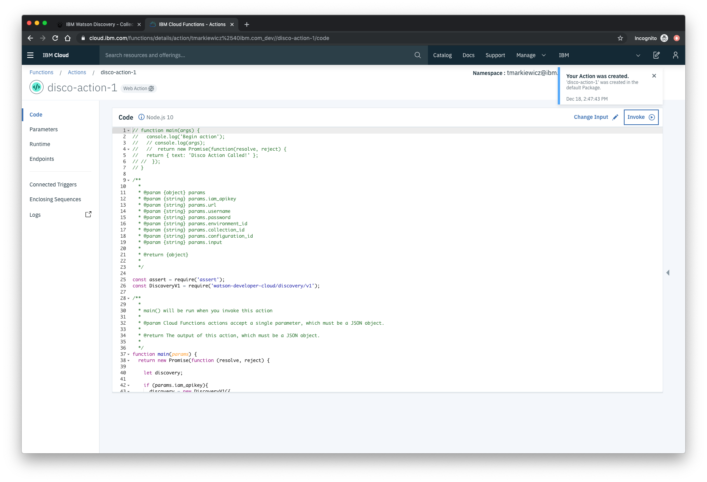

If you press the **Invoke** button, it will fail due to credentials not being defined yet. We'll do this next.

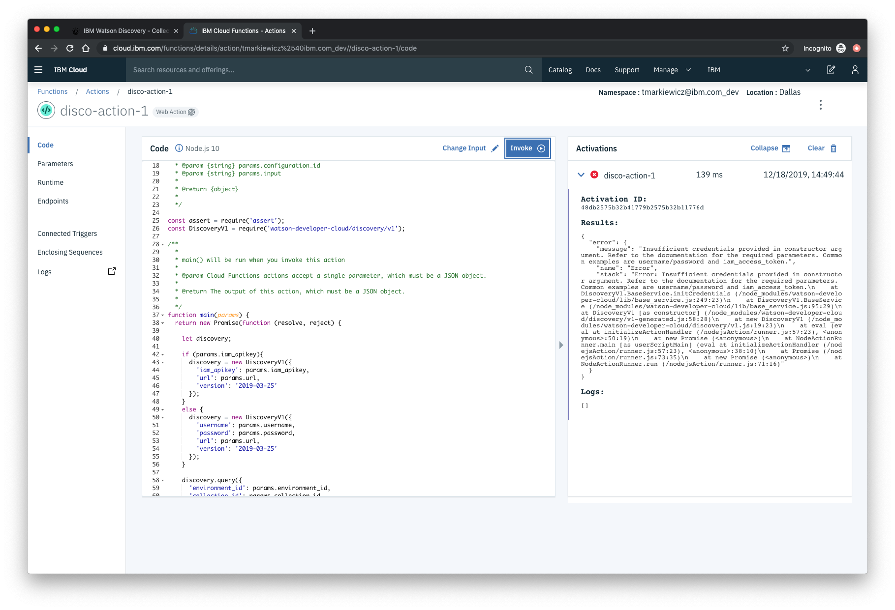

Select the **Parameters** tab [1]:

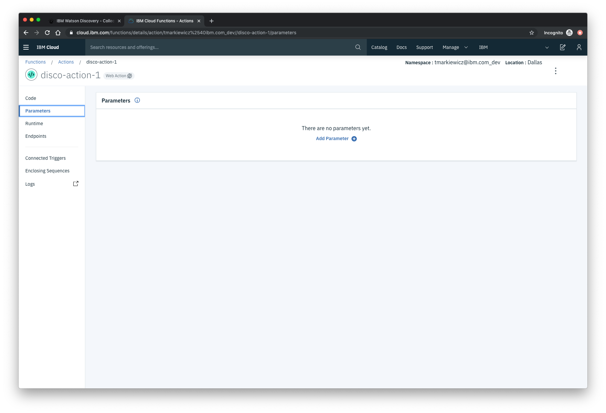

Add the following keys:

* url
* environment_id
* collection_id
* iam_apikey

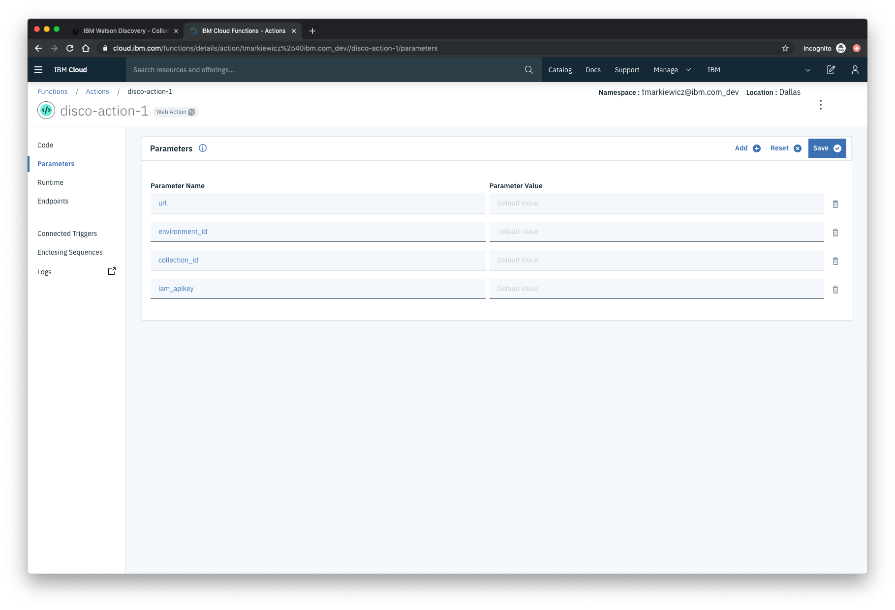

For values, please use the values associated with the Discovery service you created in the previous step.

> Note: Make sure to enclose your values in double quotes.

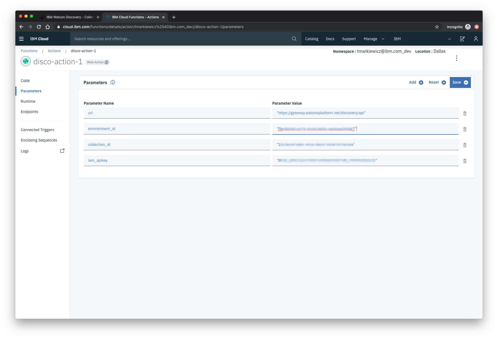

Now that the credentials are set, return to the **Code** panel and press the **Invoke** button again. Now you should see actual results returned from the Discovery service:

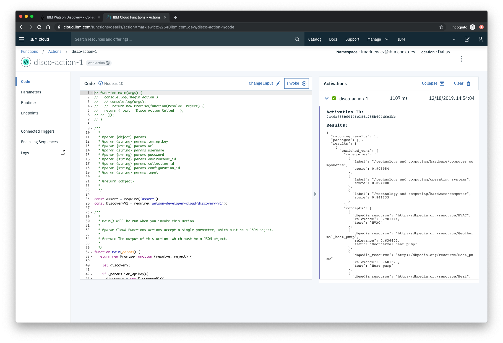

Next, go to the **Endpoints** panel:

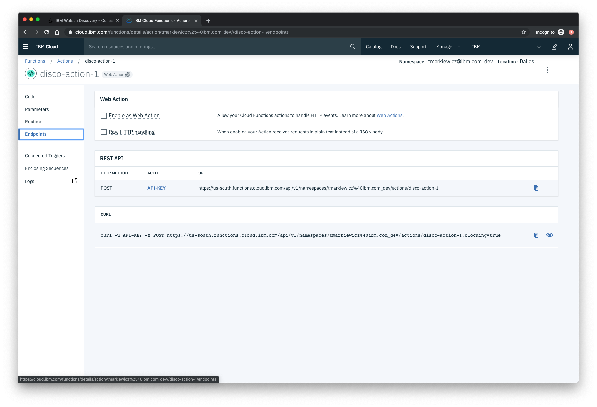

Click the checkbox for **Enable as Web Action**. This will generate a public endpoint URL.

Take note of the REST API endpoint value, as this will be needed by Watson Assistant in a future step.

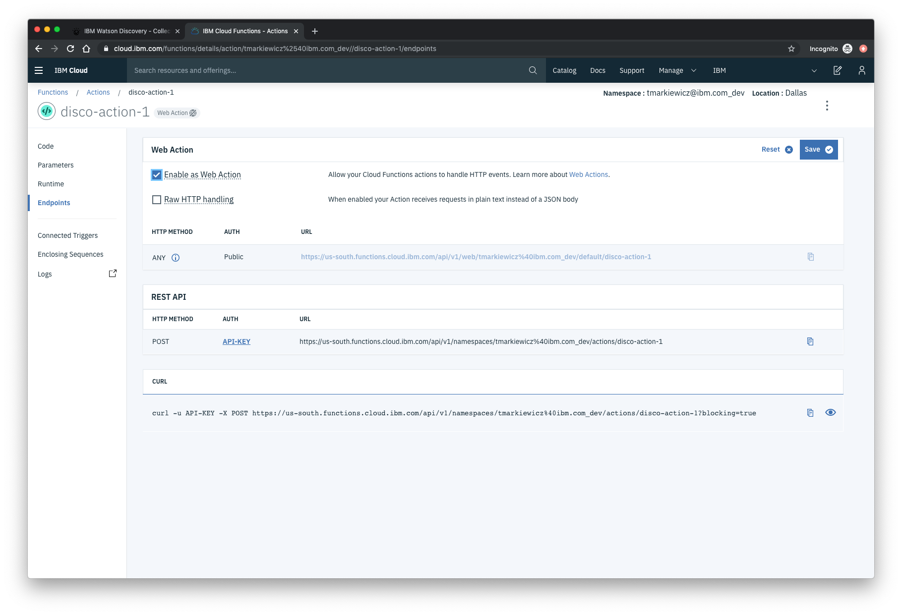

To verify you have entered the correct Discovery parameters, execute the provied `curl` command. If it fails, re-check your parameter values.

> NOTE: An IBM Cloud Functions service will not show up in your dashboard resource list. To return to your defined Action, you will need to access Cloud Functions by selecting Create Resource from the main dashboard panel (as shown at the beginning of this step).
