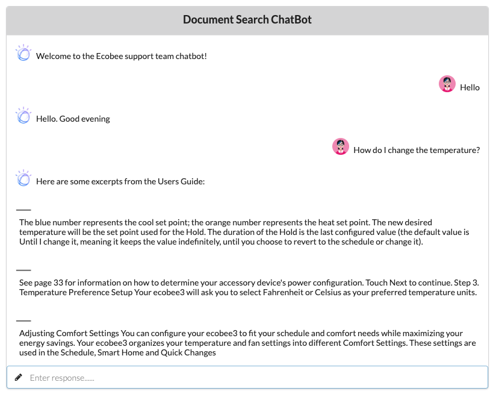

In this final step, we're going to configure and run a Node.js application that ties Watson Discovery, Wastson Assistant, and Cloud Functions together in a web-based chatbot application.

The application code is provided in the repo and in this step we'll just be changing the configuration to talk with our Watson Assistant instance.

## Get the IBM Cloud services credentials and add to .env file
First, navigate to `_discovery/app` in the repo.

Next, copy the local `env.sample` file and rename it `.env`:

```bash
cp env.sample .env
```

Now update the `.env` file with the credentials from your Watson Assistant service.

```bash
# Copy this file to .env and replace the credentials with
# your own before starting the app.

# Watson Assistant
ASSISTANT_SKILL_ID=<add_assistant_skill_id>
ASSISTANT_IAM_APIKEY=<add_assistant_iam_apikey>

# Run locally on a non-default port (default is 3000)
# PORT=3000
```

The apikey credential can be found by clicking the Service Credentials tab, then the View Credentials option from the panel of your created Watson Assistant service.

An additional `ASSISTANT_SKILL_ID` value is required to access the Watson Assistant service. To get this value, select the `Manage` tab, then the `Launch tool` button from the panel of your Watson Assistance service. From the service instance panel, select your Assistant to display the assigned skills. For this code pattern, we used the dialog skill named `Custom Skill Sample Skill` that comes with the service:


Click the option button (highlighted in the image above) to view the skill `API Details`. Here you will find the `Skill ID` value.


## Run the application

```bash
npm install
npm start
```

Access the UI by pointing your browser at `localhost:3000`.

Then try entering some of these sample questions and examine the results:

* **How do I set a schedule?**
* **How do I set the temperature?**
* **How do I set the time?**

## Sample application output


